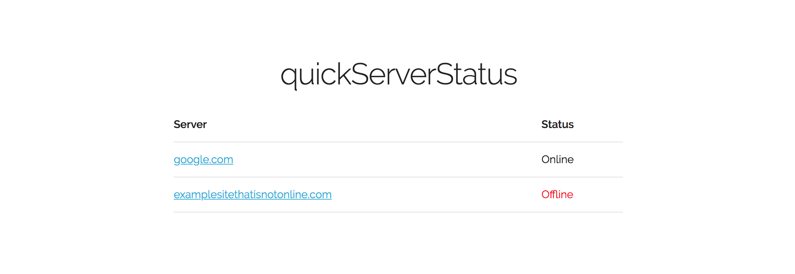

# quickServerStatus
> Quick and dirty page to check if multiple servers are online.

This script provides a quick way to monitor multiple hosts and ensure they are online. 
It also provides a function that be called to return a sites status.

## Requirements

* Web Server
* &gt;= PHP5.6

## Installation

1. Copy files to web server directory.
2. Edit hosts.txt to include the servers' IP address or hostname.
3. Open index.php in web browser.

## Meta

Bennett Warner – [@b_e_n](https://twitter.com/b_e_n)

Distributed under the MIT license. See ``LICENSE.md`` for more information.

[https://github.com/bennettwarner/quickServerStatus](https://github.com/bennettwarner/)
